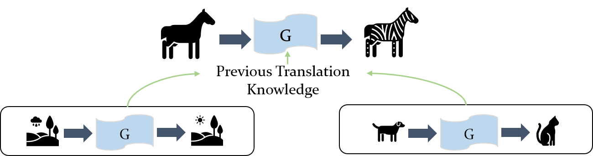

# MT-GAN-PyTorch
PyTorch Implementation of AAAI-2020 Paper "Learning to Transfer: Unsupervised Domain Translation via Meta-Learning" 

# Dependency:
Python 3.6

PyTorch 0.4.0
# Usage:
### Unsupervised Domain Translation via Meta-Learning
1. Downloading labels2photos, horses2zebras, summer2winter, apple2orange, monet2photo, cezanne2photo, ukiyoe2photo, vangogh2photo, photos2maps and labels2facades datasets following [CycleGAN](https://github.com/junyanz/pytorch-CycleGAN-and-pix2pix).

2. Organize these translation datasets as:

       meta_datarooot
       ├── vangogh2photo
       |   ├── trainA
       |   ├── trainB
       |   
       ├── ukiyoe2photo
           ├── trainA
           ├── trainB
       ...
    
3. Train MT-GAN on 10-shot tranlation:

   `$ python train.py --name mtgan_results --model mt_gan --meta_dataroot meta_datarooot --k_spt 10 --k_qry 10 --finetune_step 1000`
   
4. Test MT-GAN on 10-shot translation:
  
   `$ python test.py --name mtgan_results --model mt_gan --meta_dataroot meta_datarooot --k_spt 10 --k_qry 10 --finetune_step 1000`
   
5. Train MT-GAN on 5-shot translation:

   `$ python train.py --name mtgan_results --model mt_gan --meta_dataroot meta_datarooot --k_spt 5 --k_qry 5 --finetune_step 1000`
   
6. Test MT-GAN on 5-shot translation:
  
   `$ python test.py --name mtgan_results --model mt_gan --meta_dataroot meta_datarooot --k_spt 5 --k_qry 5 --finetune_step 1000`

